# AI Prototyping Tool

[](https://github.com/SamPlaysKeys/AI-Prototyping-Tool/actions/workflows/ci-cd.yml)
[](https://github.com/SamPlaysKeys/AI-Prototyping-Tool/actions/workflows/code-quality.yml)
[](https://codecov.io/gh/SamPlaysKeys/AI-Prototyping-Tool)
[](https://opensource.org/licenses/MIT)
[](https://www.python.org/downloads/)

A comprehensive tool that uses LM Studio and local AI models to guide users through the complete prototyping process, from initial idea to implementation plan and presentation generation.

## 🎯 Overview

This tool transforms your initial ideas into structured, actionable prototyping plans by generating:

- 📋 **Problem Statement** - Clear definition of the core issue or opportunity
- 👥 **User Personas** - Detailed profiles of target users
- 📝 **Use Cases** - Comprehensive scenarios and user interactions
- 🔧 **Tool Outline** - Technical architecture and feature breakdown
- 📚 **Implementation Instructions** - Step-by-step development guide
- 🎯 **CoPilot365 Presentation Prompt** - Ready-to-use prompt for generating presentations
- 🔍 **Plan Evaluation** - Assessment of accuracy, effectiveness, and next steps

## 🏠 Architecture


## 🔄 Workflow


## 🛠️ Installation & Setup

### Prerequisites

1. **LM Studio** - Download and install from [lmstudio.ai](https://lmstudio.ai/)
2. **Python 3.8+** - Ensure you have Python installed
3. **Local AI Model** - Download a suitable model in LM Studio (e.g., Llama 2, Code Llama, etc.)

### Installation Steps

1. **Clone the repository:**
   ```bash
   git clone https://github.com/your-username/AI-Prototyping-Tool.git
   cd AI-Prototyping-Tool
   ```

2. **Install dependencies:**
   ```bash
   pip install -r requirements.txt
   ```

3. **Start LM Studio:**
   - Open LM Studio
   - Load your preferred AI model
   - Start the local server (default: http://localhost:1234)

4. **Make the script executable:**
   ```bash
   chmod +x ai_prototyping_tool.py
   ```

## 🚀 Usage

### Command Line Interface

#### Basic Usage
```bash
python ai_prototyping_tool.py --prompt "Your initial idea or problem description"
```

#### Interactive Mode
```bash
python ai_prototyping_tool.py --interactive
```

#### Custom LM Studio URL
```bash
python ai_prototyping_tool.py --url "http://localhost:1234" --prompt "Your idea"
```

#### Specify Output Files
```bash
python ai_prototyping_tool.py --prompt "Your idea" --output-json "my_analysis.json" --output-md "my_report.md"
```

### Command Line Arguments

| Argument | Description | Default |
|----------|-------------|----------|
| `--prompt` | Initial user prompt for prototyping (required) | - |
| `--url` | LM Studio API URL | `http://localhost:1234` |
| `--output-json` | Custom JSON output filename | Auto-generated |
| `--output-md` | Custom Markdown output filename | Auto-generated |
| `--interactive` | Run in interactive mode | False |

## 📊 Data Flow

```mermaid
flowchart LR
    subgraph Input ["📥 Input Layer"]
        A[User Prompt]
        B[CLI Arguments]
        C[Configuration]
    end

    subgraph Processing ["⚙️ Processing Layer"]
        D[Problem Statement]
        E[User Personas]
        F[Use Cases]
        G[Tool Outline]
        H[Implementation Plan]
        I[Presentation Prompt]
        J[Plan Evaluation]
    end

    subgraph AI ["🤖 AI Layer"]
        K[LM Studio API]
        L[Local AI Model]
        M[System Prompts]
    end

    subgraph Output ["📤 Output Layer"]
        N[JSON Report]
        O[Markdown Report]
        P[Console Display]
        Q[File System]
    end

    %% Input to Processing Flow
    A --> D
    B --> D
    C --> D

    %% Sequential Processing Flow
    D --> E
    E --> F
    F --> G
    G --> H
    H --> I
    I --> J

    %% AI Integration
    D <--> K
    E <--> K
    F <--> K
    G <--> K
    H <--> K
    I <--> K
    J <--> K

    K <--> L
    M --> K

    %% Output Generation
    J --> N
    J --> O
    J --> P
    N --> Q
    O --> Q

    %% Styling
    classDef inputStyle fill:#e3f2fd,stroke:#1976d2,stroke-width:2px
    classDef processStyle fill:#f3e5f5,stroke:#7b1fa2,stroke-width:2px
    classDef aiStyle fill:#fff3e0,stroke:#f57c00,stroke-width:2px
    classDef outputStyle fill:#e8f5e8,stroke:#388e3c,stroke-width:2px

    class A,B,C inputStyle
    class D,E,F,G,H,I,J processStyle
    class K,L,M aiStyle
    class N,O,P,Q outputStyle
```



## 📝 Example Output

The tool generates two types of output files:

### JSON Report
```json
{
  "problem_statement": "Detailed problem analysis...",
  "personas": "User persona descriptions...",
  "use_cases": "Comprehensive use case scenarios...",
  "tool_outline": "Technical architecture and features...",
  "implementation_instructions": "Step-by-step development guide...",
  "copilot_prompt": "Ready-to-use CoPilot365 prompt...",
  "plan_evaluation": "Assessment and next steps..."
}
```

### Markdown Report
A formatted report with all sections, perfect for sharing with teams or stakeholders.

## 📚 Documentation

Detailed documentation is available in the `docs/` directory:

- [`architecture.mmd`](docs/architecture.mmd) - System architecture diagram
- [`workflow.mmd`](docs/workflow.mmd) - Sequence diagram of the analysis process
- [`class-structure.mmd`](docs/class-structure.mmd) - Class relationships and structure
- [`data-flow.mmd`](docs/data-flow.mmd) - Data flow visualization
- [`user-journey.mmd`](docs/user-journey.mmd) - User journey mapping

## 🔧 Troubleshooting

### Common Issues

1. **Connection Error to LM Studio**
   - Ensure LM Studio is running and the server is started
   - Check that the URL is correct (default: http://localhost:1234)
   - Verify that a model is loaded in LM Studio

2. **Timeout Errors**
   - Large prompts may take longer to process
   - Consider using a faster model or reducing complexity
   - Check your system resources

3. **Empty or Poor Quality Responses**
   - Try a different AI model in LM Studio
   - Ensure your prompt is clear and specific
   - Check that the model is properly loaded

### Debug Mode
```bash
python ai_prototyping_tool.py --prompt "Your idea" --verbose
```

## 🚀 CI/CD & Deployment

This project includes comprehensive GitHub Actions workflows for continuous integration and deployment.

### 🔄 Automated Workflows

- **CI/CD Pipeline**: Multi-version Python testing, code quality, security scanning
- **Code Quality**: Black, flake8, mypy, bandit security checks
- **Dependency Updates**: Weekly automated dependency updates
- **Release Management**: Automated releases with changelog generation

### ⚠️ Setup Required

**Note**: GitHub Actions are currently configured for manual triggers only. To enable full CI/CD:

#### 1. Configure Repository Secrets

Go to GitHub repository → Settings → Secrets and variables → Actions:

```bash
# Required for PyPI publishing
PYPI_API_TOKEN=pypi-...         # Get from https://pypi.org
TEST_PYPI_API_TOKEN=pypi-...     # Get from https://test.pypi.org

# Optional for enhanced features
CODECOV_TOKEN=your-token         # Get from https://codecov.io
SLACK_WEBHOOK_URL=https://hooks.slack.com/... # For notifications
```

#### 2. Enable Automatic Triggers

Uncomment trigger sections in `.github/workflows/*.yml` files:

```yaml
# In ci-cd.yml, code-quality.yml, dependency-update.yml
on:
  push:
    branches: [ main, develop ]
  pull_request:
    branches: [ main ]
  schedule:
    - cron: '0 9 * * 1'  # Weekly dependency updates
```

#### 3. Set Up External Services

- **PyPI Account**: Create accounts at [PyPI](https://pypi.org) and [TestPyPI](https://test.pypi.org)
- **CodeCov**: Sign up at [codecov.io](https://codecov.io) for coverage reporting
- **Slack Integration**: Create Slack app with incoming webhooks (optional)

### 📊 Available Workflows

- `ci-cd.yml`: Complete CI/CD pipeline with testing, building, and deployment
- `code-quality.yml`: Code quality enforcement with multiple tools
- `dependency-update.yml`: Automated dependency management
- `release.yml`: Release automation with changelog generation

## 🤝 Contributing

Contributions are welcome! Please feel free to submit a Pull Request. For major changes, please open an issue first to discuss what you would like to change.

### Development Setup
```bash
git clone https://github.com/SamPlaysKeys/AI-Prototyping-Tool.git
cd AI-Prototyping-Tool
pip install -r requirements.txt
pip install -e .
```

### Code Quality

Before submitting PRs, ensure code quality:

```bash
# Format code
black src/ cli/ tests/

# Sort imports
isort src/ cli/ tests/

# Check linting
flake8 src/ cli/ tests/

# Run tests
pytest tests/ -v --cov=src --cov=cli
```

## 📜 License

This project is licensed under the MIT License - see the [LICENSE](LICENSE) file for details.

## 🙏 Acknowledgments

- [LM Studio](https://lmstudio.ai/) for providing an excellent local AI model interface
- The open-source AI community for developing amazing language models
- Contributors who help improve this tool

---

**Made with ❤️ for the prototyping community**
