# AI Prototyping Tool Documentation

This directory contains comprehensive documentation for the AI Prototyping Tool, including visual diagrams using Mermaid syntax for better understanding of the system architecture and workflows.

## 📋 Documentation Index

### 🏗️ Architecture Documentation

#### System Architecture
**File:** [`architecture.mmd`](architecture.mmd)

**Description:** High-level system architecture showing the relationships between components, data flow, and system boundaries.


#### Class Structure
**File:** [`class-structure.mmd`](class-structure.mmd)

**Description:** UML-style class diagram showing the object-oriented design, relationships between classes, and their methods.


### 🔄 Process Documentation

#### Workflow Sequence
**File:** [`workflow.mmd`](workflow.mmd)

**Description:** Detailed sequence diagram showing the step-by-step process flow from user input to final output generation.


#### Data Flow
**File:** [`data-flow.mmd`](data-flow.mmd)

**Description:** Comprehensive data flow diagram showing how information moves through different layers of the system.

```mermaid
flowchart LR
    subgraph Input ["📥 Input Layer"]
        A[User Prompt]
        B[CLI Arguments]
        C[Configuration]
    end

    subgraph Processing ["⚙️ Processing Layer"]
        D[Problem Statement]
        E[User Personas]
        F[Use Cases]
    end

    subgraph AI ["🤖 AI Layer"]
        K[LM Studio API]
        L[Local AI Model]
    end
```



### 👤 User Experience Documentation

#### User Journey
**File:** [`user-journey.mmd`](user-journey.mmd)

**Description:** User journey map showing the complete experience from setup to implementation, including satisfaction levels at each step.


## 🎯 Quick Start Guide

### Using the Documentation

1. **For Developers:** Start with [`class-structure.mmd`](class-structure.mmd) to understand the codebase
2. **For System Architects:** Review [`architecture.mmd`](architecture.mmd) for high-level design
3. **For Process Understanding:** Follow [`workflow.mmd`](workflow.mmd) for detailed operations
4. **For Data Analysis:** Examine [`data-flow.mmd`](data-flow.mmd) for information flow
5. **For UX Research:** Study [`user-journey.mmd`](user-journey.mmd) for user experience

### Viewing Mermaid Diagrams

These Mermaid diagrams can be viewed in several ways:

#### GitHub (Recommended)
GitHub natively supports Mermaid diagrams. Simply view the `.mmd` files directly in the GitHub interface.

#### Mermaid Live Editor
1. Go to [mermaid.live](https://mermaid.live/)
2. Copy the content from any `.mmd` file
3. Paste it into the editor for interactive viewing

#### VS Code Extension
Install the "Mermaid Markdown Syntax Highlighting" extension for VS Code to view diagrams directly in the editor.

#### Local Tools
```bash
# Install mermaid-cli globally
npm install -g @mermaid-js/mermaid-cli

# Generate PNG from any diagram
mmdc -i docs/architecture.mmd -o architecture.png

# Generate SVG (vector format)
mmdc -i docs/workflow.mmd -o workflow.svg
```

## 📖 Additional Documentation

### Code Documentation
- **Inline Comments:** All major functions and classes include comprehensive docstrings
- **Type Hints:** Full type annotations for better IDE support and code clarity
- **README Files:** Component-specific documentation in relevant directories

### API Documentation
- **LM Studio Client:** Detailed API interaction patterns
- **Core Methods:** Function signatures and expected inputs/outputs
- **Error Handling:** Common error scenarios and resolution strategies

### Configuration Documentation
- **Environment Variables:** All configurable options
- **Command Line Arguments:** Complete CLI reference
- **Configuration Files:** JSON schema and examples

## 🔧 Maintenance

### Updating Diagrams

When modifying the codebase, ensure corresponding diagrams are updated:

1. **Code Changes:** Update relevant Mermaid diagrams
2. **New Features:** Add new components to architecture diagrams
3. **Process Changes:** Modify workflow and data flow diagrams
4. **UI Changes:** Update user journey maps

### Validation

Before committing changes to documentation:

```bash
# Validate Mermaid syntax
mmdc -i docs/architecture.mmd -o /dev/null
mmdc -i docs/workflow.mmd -o /dev/null
mmdc -i docs/class-structure.mmd -o /dev/null
mmdc -i docs/data-flow.mmd -o /dev/null
mmdc -i docs/user-journey.mmd -o /dev/null
```

### Version Control

- Keep diagrams synchronized with code versions
- Use descriptive commit messages for documentation changes
- Include diagram updates in feature branch pull requests

## 🎨 Styling Guidelines

### Colors Used
- **Input/User:** Light Blue (`#e1f5fe`)
- **Processing:** Light Purple (`#f3e5f5`)
- **AI/Model:** Light Orange (`#fff3e0`)
- **Output/Files:** Light Green (`#e8f5e8`)
- **System/Core:** Default Mermaid colors

### Naming Conventions
- **Nodes:** Clear, concise labels
- **Relationships:** Descriptive connection labels
- **Subgraphs:** Logical groupings with emoji prefixes

## 📞 Support

For questions about the documentation:

1. **Check existing diagrams** for similar patterns
2. **Review the main README** for context
3. **Open an issue** for clarification requests
4. **Contribute improvements** via pull requests

---

*Documentation maintained by the AI Prototyping Tool team*
